# Adding Components to KiCad
IMAGINE THIS, you're designing your circuit, and you have everything planned out, but you can't find component "MCP3204T-CI/ST" in the RSX library!!> [!NOTE]
> WHAT ARE YOU GONNA DO NOW?????
Boy do I HAVE the solution for YOU!

> [!IMPORTANT]
> BEFORE YOU MAKE ANY CHANGES TO ANYTHING ON KICAD EVER, MAKE SURE YOU PULL. 

> [!NOTE]
> We will be using the following component throughout this KiCad Tutorial:
> - [12-bit ADC](https://www.digikey.ca/en/products/detail/microchip-technology/MCP3204T-CI-ST/319442)

<i>Figure 1: Stupid image</i>

> [!NOTE]
> Step 1. Find the component on Digikey

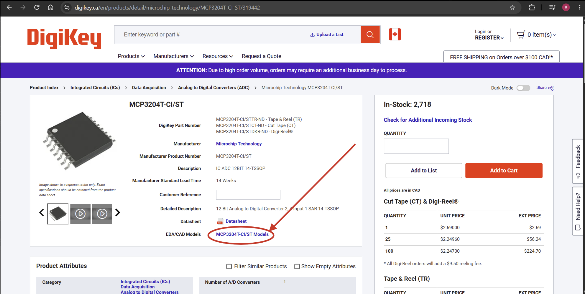

<i>Figure 2: The Digikey Component</i>

> [!NOTE]
> Step 2. Click the circled cad model in red
> This will bring you to a page where you can download symbols, footprints, and 3D models directly from the manufacturer.

> [!NOTE]
> Step 3. Once you're on this page, you should see something like the figure below. Select the download format button. Then you wanna select the download format you see in figure __. Once the correct things are selected click the download button.

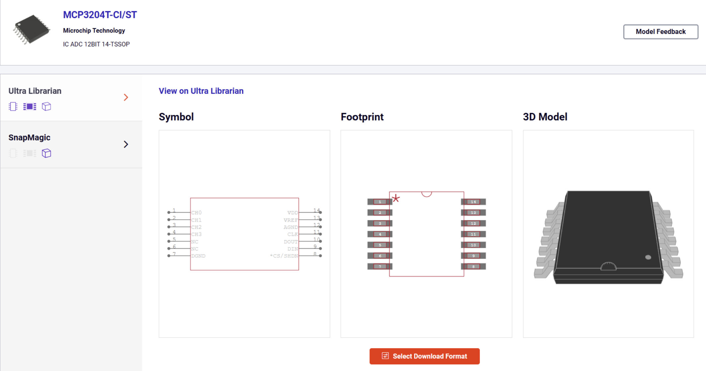

<i>Figure 3: component download page</i>

> [!NOTE]
> Step 4. Download the 3d model as a STEP file and the symbol/footprint using the KiCad v6+ as shown in Figure 4 below.

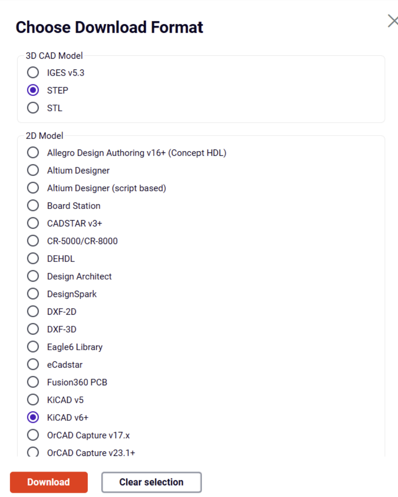

<i>Figure 4: Download Format</i>

> [!NOTE]
> Step 5. Once you have the zip file downloaded, make sure you extract all the files.

> [!NOTE]
> Step 6. Open KiCad, and click into the symbol editor as shown in figure 5

> [!NOTE]
> Step 7. 😮

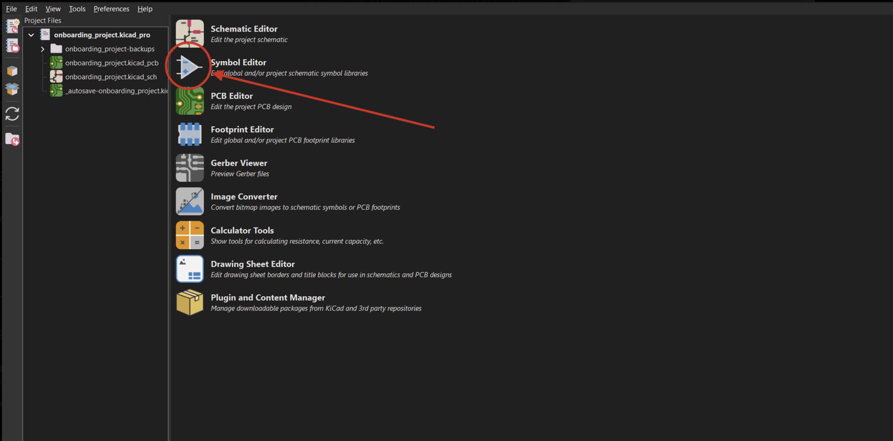

<i>Figure 5: Symbol editor </i>

> [!NOTE]
> Step 8. Search up RSX sensors as shown in figure 6 and make sure you CLICK IT before doing step 9

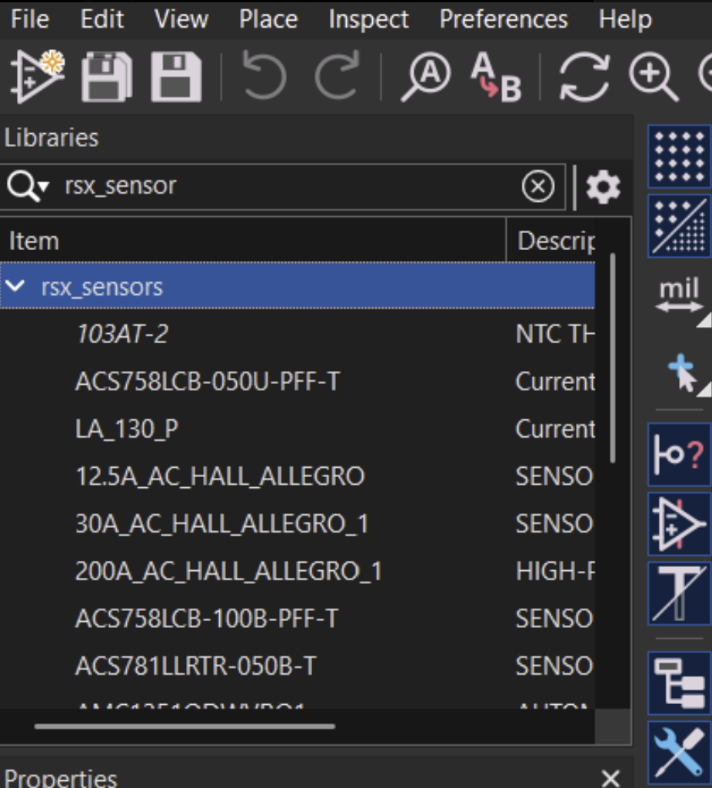

<i>Figure 6: RSX_Sensors </i>

> [!NOTE]
> Step 9. Click File -> Import -> New Symbol as shown in figure 7

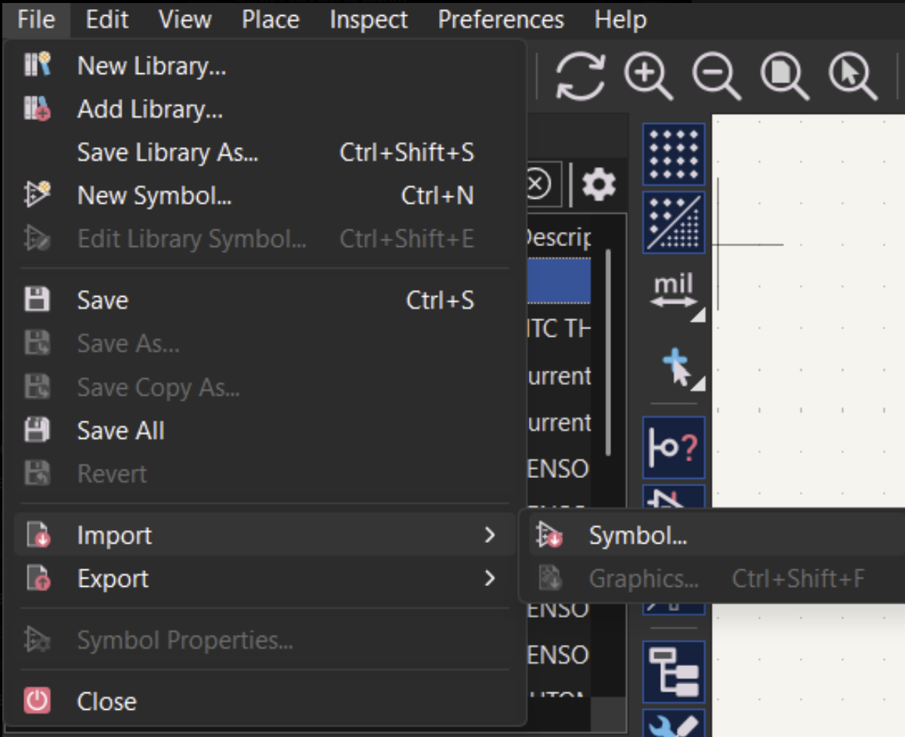

<i>Figure 7: Import </i>

> [!NOTE]
> Step 10. Your file explorer should pop up, as shown in figure 8. Make sure you click the circled item in figure 8. 

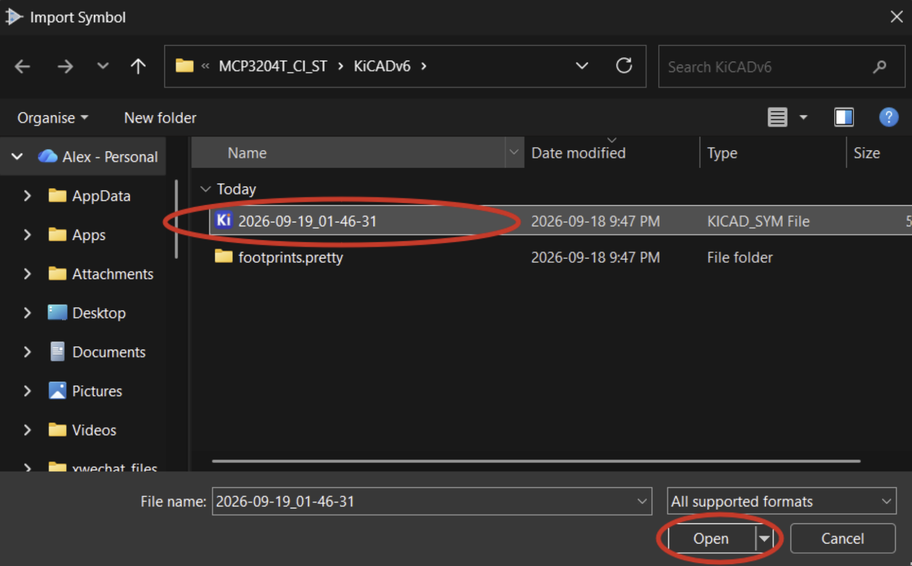

<i>Figure 8: File explorer </i>

> [!NOTE]
> Step 11. Once you click the circled item from step 10, you will be brought to the page shown in figure 9. Now, you can select your symbol, as shown by the red arrow, and then click import. 

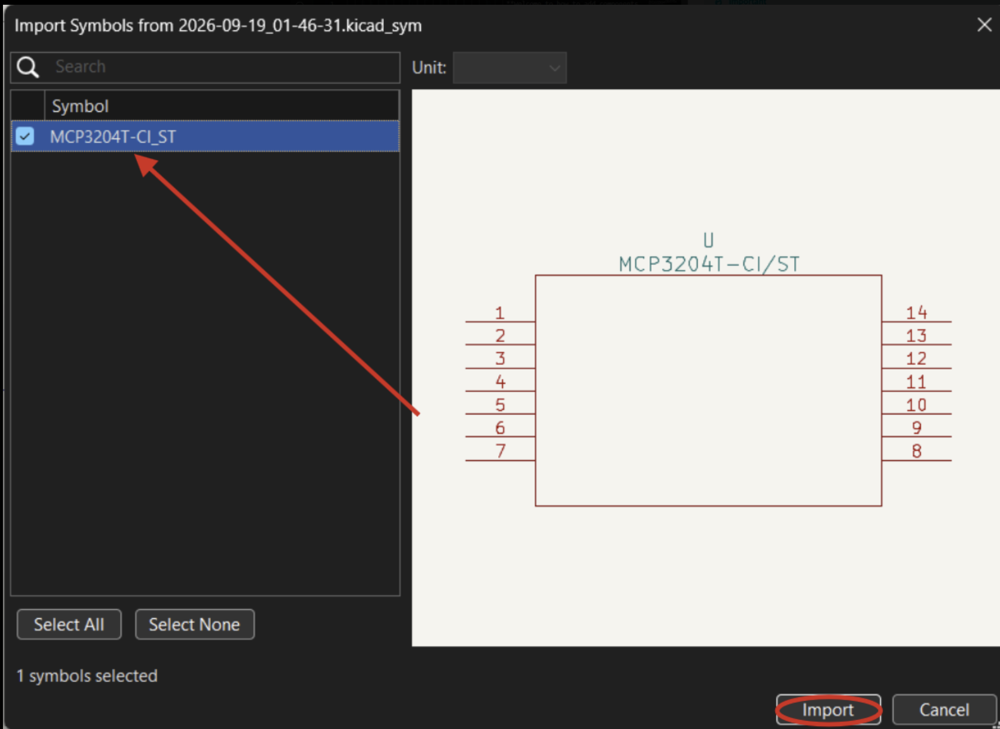

<i>Figure 9: Import </i>

> [!NOTE]
> Step 12. PLEASE PRESS CTRL + S TO SAVE NOW. DO NOT FORGET TO SAVE PLS OR THE WORLD WILL EXPLODE AND WE WILL ALL DIE.

> [!NOTE]
> Step 13. Go back to the main kiCad page as shown in figure 10. Click on the footprint editor circled in red. 

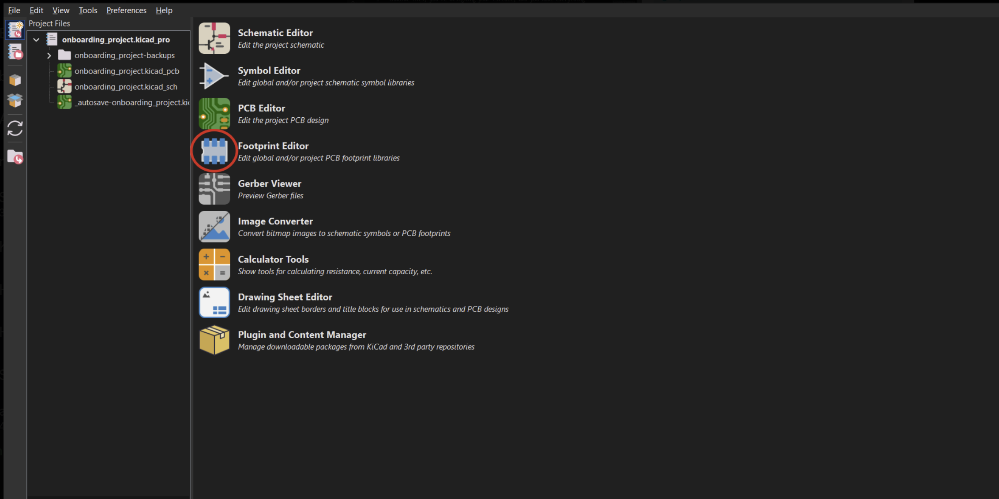

<i>Figure 10: Footprint editor </i>

> [!NOTE]
> Step 14. Search up RSX_Sensors and select it, as shown in figure 11.

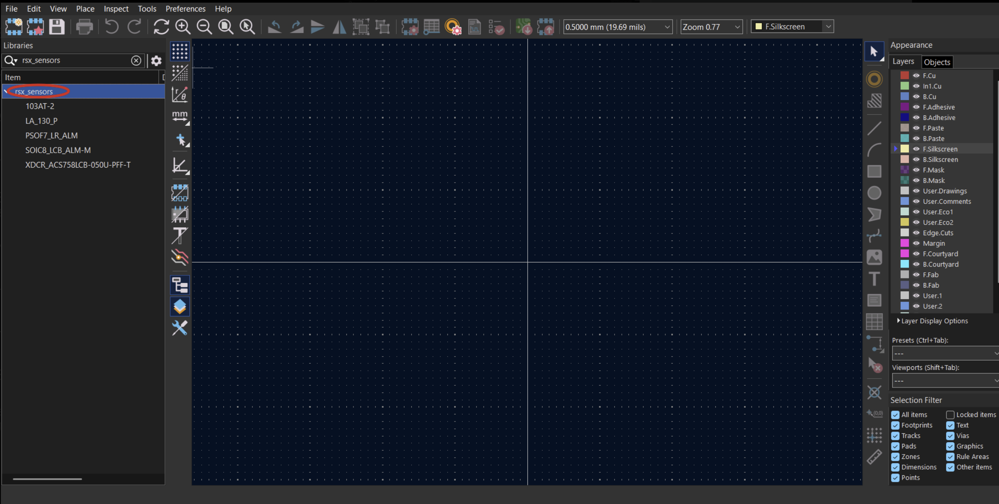

<i>Figure 11: RSX_SENSORS</i>

> [!NOTE]
> Step 15. Click file -> import -> footprint (WHILE RSX_SENSORS IS CLICKED) 

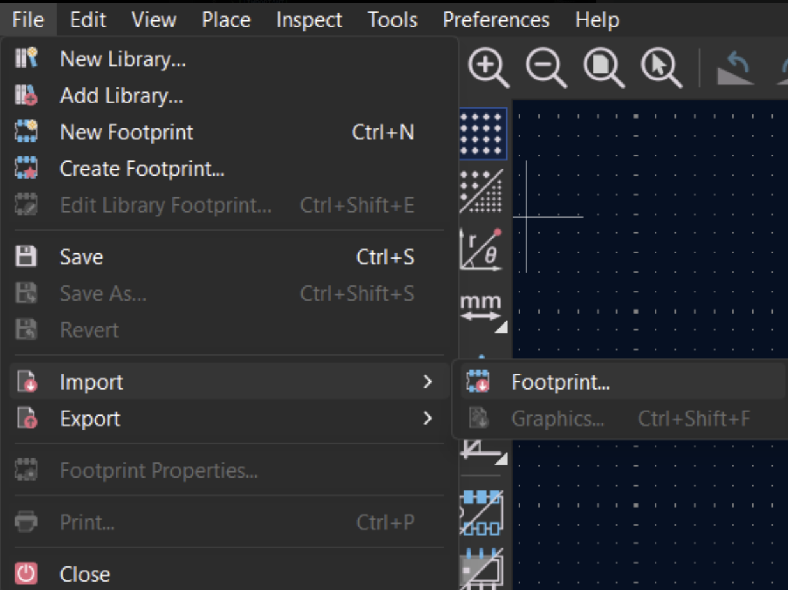

<i>Figure 12: Import</i>

> [!NOTE]
> Step 16. Your file explorer should pop up, as shown in figure 13. Make sure you click the circled item in figure 13. Then click OPEN. (You just need one footprint)

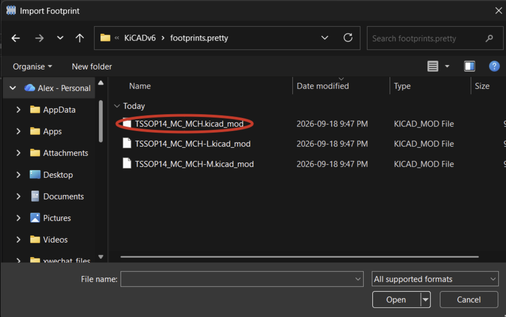

<i>Figure 13: File explorer</i>

> [!NOTE]
> Step 17. You will be brought to a page that looks like the image in figure 13. Click Ctrl S to save pls PLEASE PLEAASEEEE. And then follow what the image says.

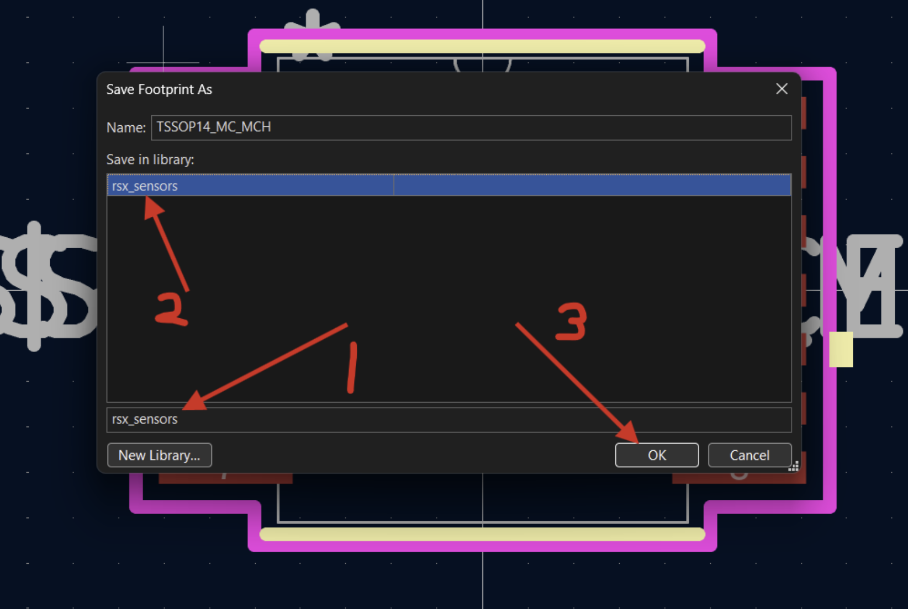

<i>Figure 14: COMPELTE IMPORT</i>

1. Search RSX SENSORS
2. CLick RSX_SENSORS
3. CLICK OK. 

> [!NOTE]
> Step 18. Once you click ok, you should be able to see your new component footprint in rsx_sensors as shown in figure 14. 

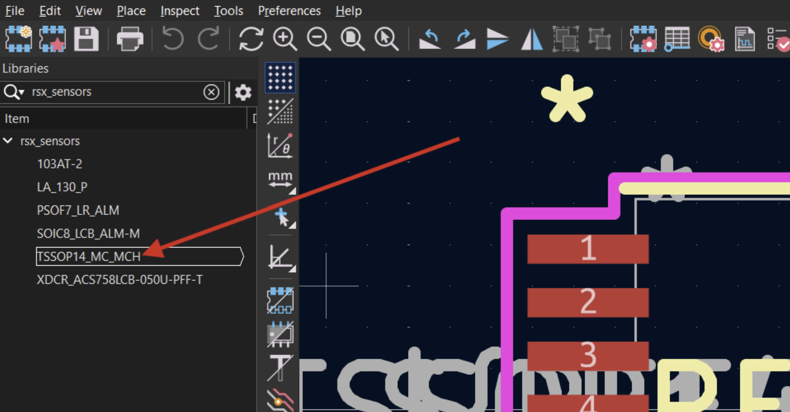

<i>Figure 15: YAY</i>

### 3D - MODEL!!!!

> [!NOTE]
> Step 19. Go to you file directory, and find where you put RSX standard library -> RSX 3d -> RSX_sensors.3dshapes. If you followed Angel's fantastic tutorial on how to add the library, you should have put it in somewhere like this : <my_directory>/rsx_standard_library/rsx_3d. Otherwise, we can't really help you, just find it bro you got this we believe in YOU!!!

> [!NOTE]
> Step 20. Once you are in RSX_sensors.3Dshapes look at the figure below and make sure you actually see your component there. If not, please review the steps above and make sure you SAVED when directed to do so. (Just spam the ctrl S ONG)

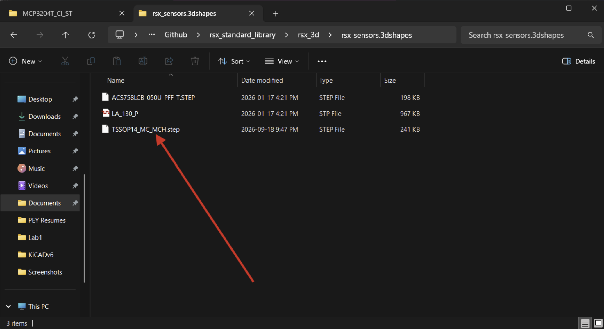

<i>Figure 16: 3DSHAPES</i>

LINKING THE MODELS
> [!NOTE]
> Step 21. Go to your schematic as show in figure 16. (Review step __ on how to open your schematic). Click on any white open space and then press E to open the symbol properties. There should be reference, value, footprint, datasheet, and description.

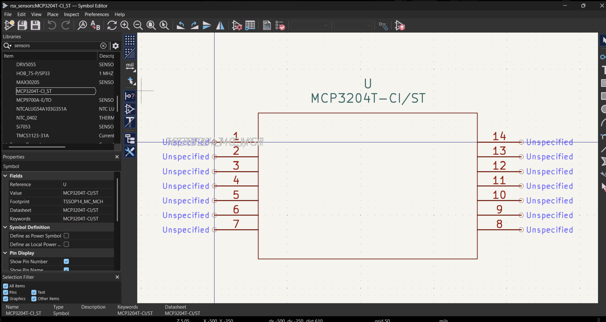

<i>Figure 17: LINKING</i>

> [!NOTE]
> Step 22. Use the button circled to add 3 more fields: DPN, MFR, MPN. 

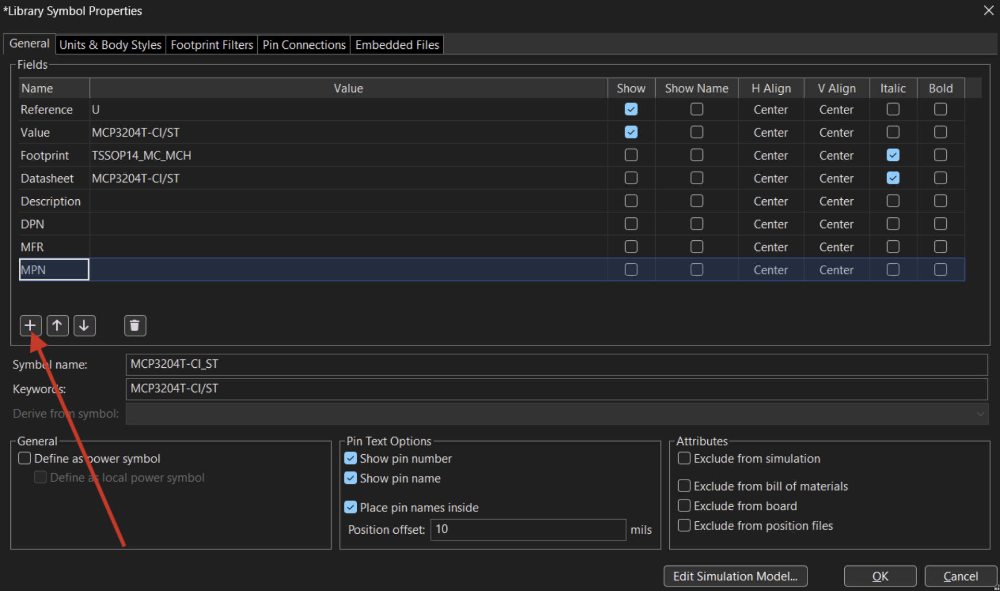

<i>Figure 18: Adding Fields</i>

> [!NOTE]
> Step 23. Go back to your Digikey Page as shown in the figure below. Use the information provided to fill in all the fields. SPECIFICALLY for DPN make sure you're selecting CUT TAPE.

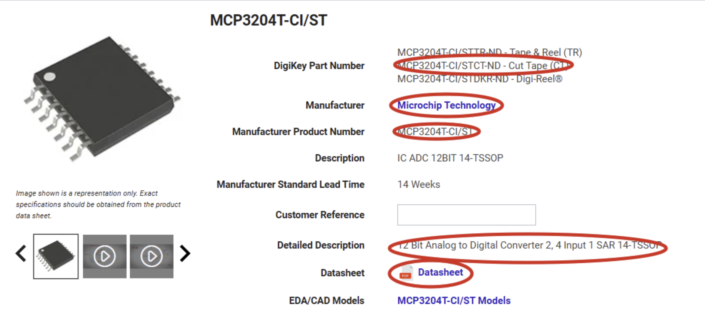

<i>Figure 19: Digikey Page</i>

> [!HINT]
> Figure 19 shows what your screen should look like. Make sure the field types are matching. For example you actually have to put in the datasheet LINK. But for DPN and MPN its just the number etc. PLEASE double check to make sure this is done correctly. 

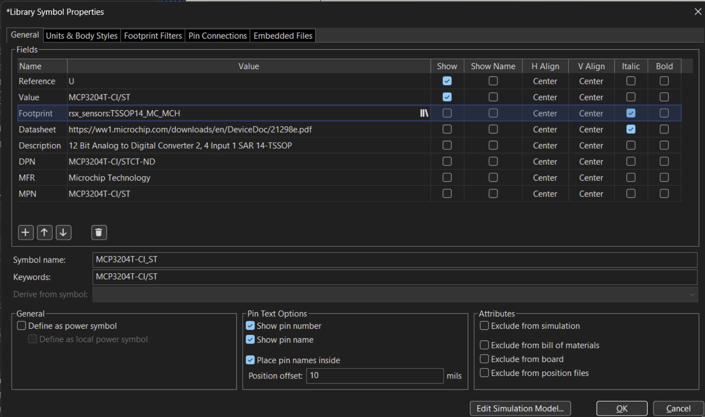

<i>Figure 20: Double check field types</i>

> [!NOTE]
> Step 24. Click the library symbol shown in figure 20. Just make sure the footprint you have in the field is the same as the one you just added from digikey. If its not, please select the one that you JUST ADDED, because sometimes it just autofills with some random footprint. 

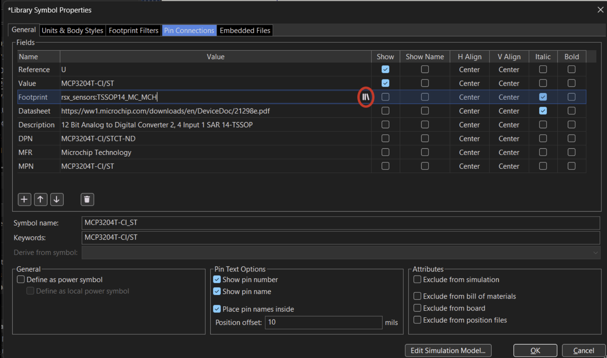

<i>Figure 21: Double check footprint</i>

> [!NOTE]
> Step 25. Go to your footprint editor, as shown below in figure 21. Similarily to what we did in the symbol editor, click an open space then press E. 

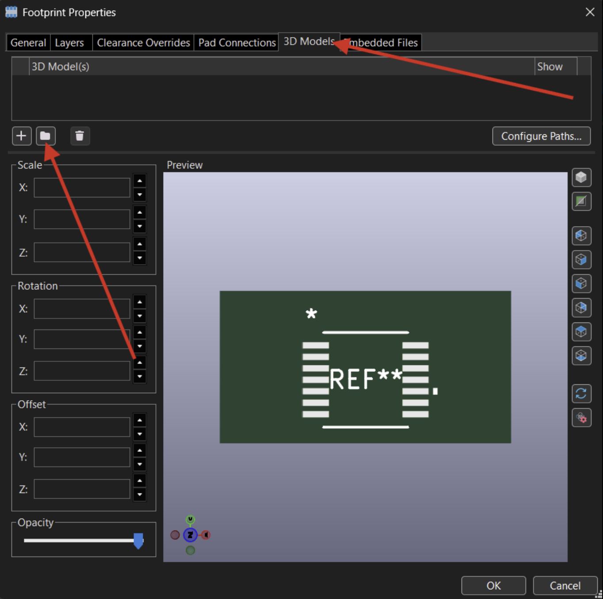

<i>Figure 22: Footprint ediotr</i>

> [!NOTE]
> Step 26. You should be brought to the page shown below. You're gonna wanna make sure you click the 3D models tab as highlighted in the figure. 

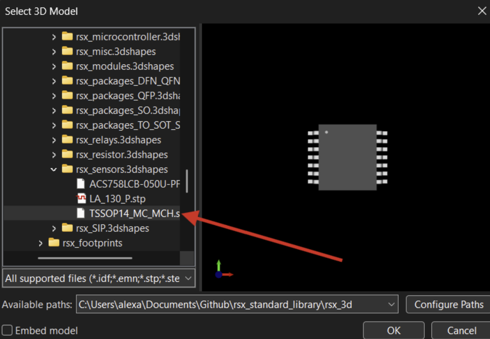

<i>Figure 23: 3D models tab</i>

> [!NOTE]
> Step 27. Click the file button, pointed to by the red arrow. You're going to be brought to a file explorer-like page. You have to FIND the correct 3D model that you imported from Digikey. Once you find it, click OK. 

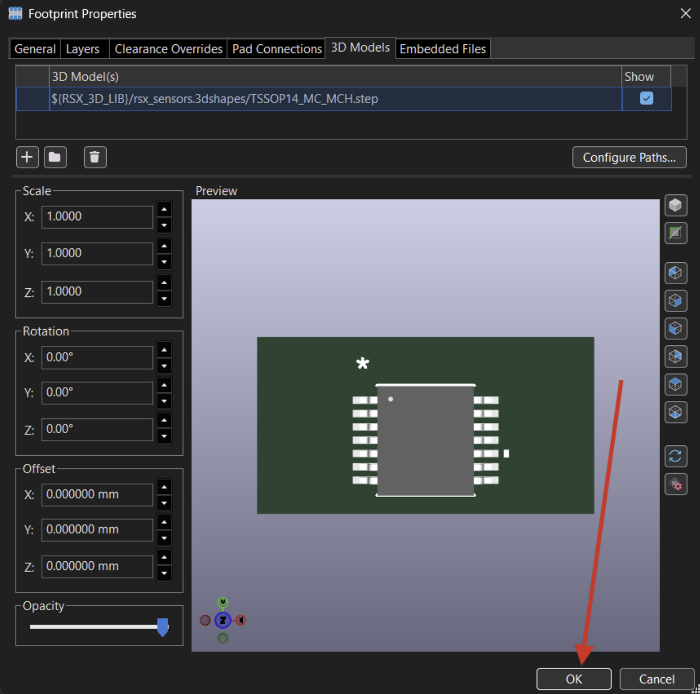

<i>Figure 24: Linking the model</i>

> [!NOTE]
> Step 28. You will see something like in figure 24, just press ok again.

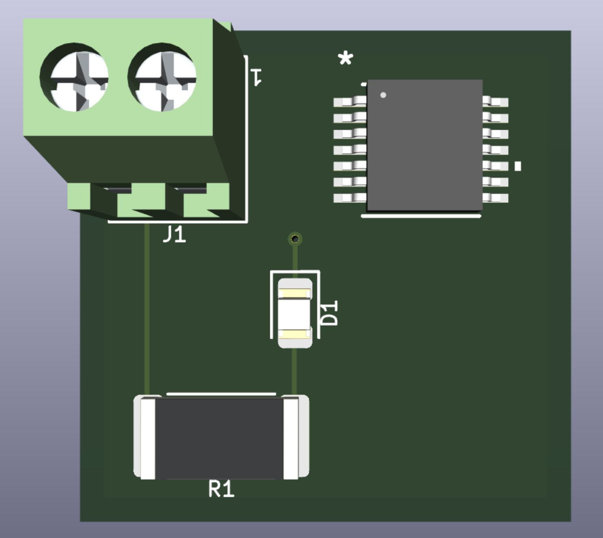

<i>Figure 25: JUST PRESS OK </i>

> [!NOTE]
> Step 29. PRES CTRL S ON EVERY SCREEN EVER. specifically your symbol and footprint editor. MAKE SURE YOU SAVE IT OR YOU're GOING TO CRY ABOUT IT LATER I PROMISE YOU. 

> [!NOTE]
> Step 30. Step 30 would be to push. HOWEVER, the chip used in this example is ALREADY in the the library because NIca and ALex spent 3.5 hours making this tutorial JUST FOR YOU. So please don't push 20 million more of these. THis is just for your reference for when you want to add a component of your own. 

> [!IMPORTANT] IF YOU HAVE ANY QUESTIONS, reach out to NIca or Alex or Angel

### Discarding Any Unwanted Changes.

Maybe you decided you wanted to go through this whole tutorial and now you're like wtflip do I do with all these changes that I made!!!
Here is how you discard those changes properly:

1. Go into Github Desktop
2. Select RSX standard library repository
3. Right click "changed files"
4. Discard all Changes

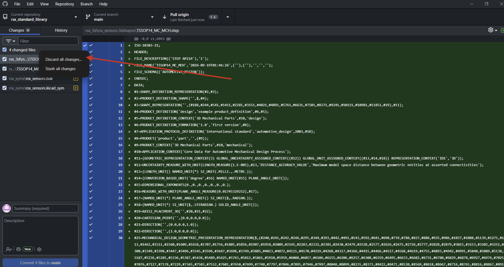

<i>Figure 26: Discarding changes </i>

