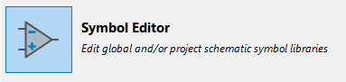
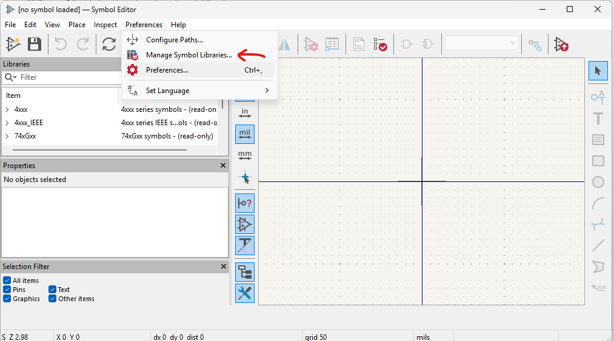
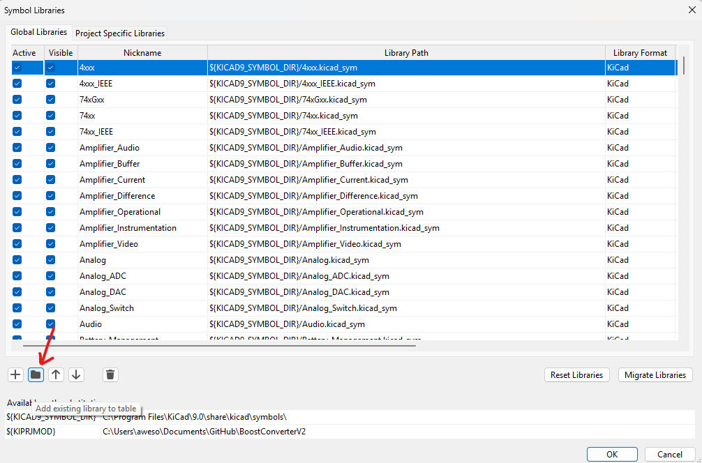
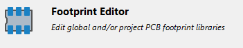
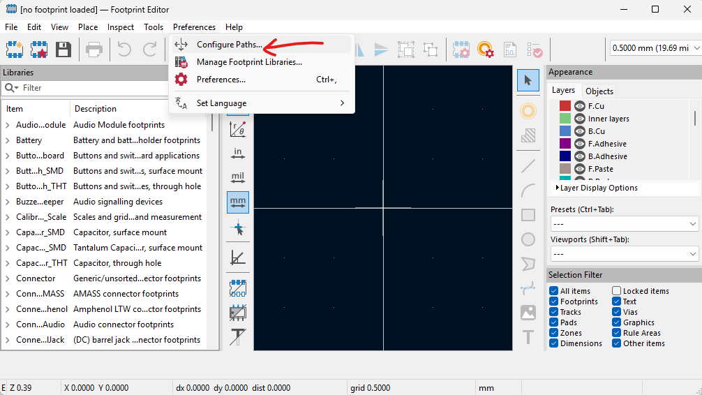
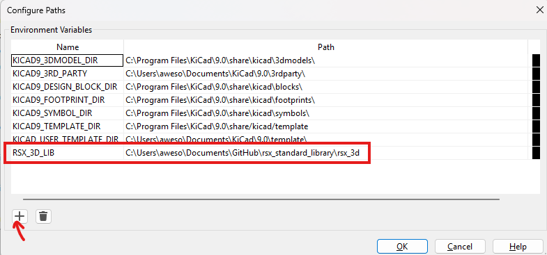

# Kicad Installation + Libraries Setup

> [!NOTE]
> Watch this videa if you don't want to go through the document: [KiCad Installation + Libraries Setup](https://www.youtube.com/watch?v=v_a2_bqHfKQ)


> [!IMPORTANT]
> - When cloning the reponsitory in the video the local repository name is ```rsx_standard_library2``` instead of ```rsx_standard_library```
> - MAKE SURE TO USE: ```rsx_standard_library``` 

------------------------------

Steps:
1. Download [KiCad](https://www.kicad.org/download) onto your local computer (please download the most updated please -> ver. 9.0.4)
2. Install KiCad 
- a. Next -> Next -> Next -> Install
- b. Move to next step while we wait
3. Clone this repository onto your local computer: [rsx_standard_library](https://github.com/rsx-electrical/rsx_standard_library)
- a. Download [Git](https://git-scm.com)

> [!NOTE] 
> Git installation is skipped. Refer to the linked guides.

- b. Install git. Here's a [guide](https://git-scm.com/book/en/v2/Getting-Started-Installing-Git)
> [!NOTE]
> - Here's an easier guide for windows, watch until 1:14. [https://www.youtube.com/watch?v=iYkLrXobBbA](https://www.youtube.com/watch?v=iYkLrXobBbA)
- c. In git bash: (fill in the < >)

```bash
cd <my_directory>
git clone https://github.com/rsx-electrical/rsx_standard_library.git
```
- d. if you ```ls rsx_standard_library```, you should see:
```bash
$ ls rsx_standard_library
README.md  rsx_3d/  rsx_footprints/  rsx_syms/
```
4. Open Kicad when the installation is done
5. Import symbol library
- a. Open Symbol Editor
   <div align="center">
    
   </div>
- b. Preferences -> Manage Symbol Libraries -> Add existing library to table
   <div align="center">
    
   </div>
   <div align="center">
    
   </div>
- c. Select all the .sym files in ```<my_directory>/rsx_standard_library/rsx_syms``` -> Open
7. Go to KiCad homepage
8. Import footprint library
- a. Open Footprint Editor
   <div align="center">
    
   </div>
- b. Preferences -> Manage Footprint Libraries -> Add Existing
- c. Select all the .pretty folders in <my_directory>/rsx_standard_library/rsx_footprints -> Open
10. Add 3D models (we're still in Footprint Editor)
- a. Preferences -> Configure Paths -> +
   <div align="center">
    
   </div>
- b. add the absolute path of <my_directory>/rsx_standard_library/rsx_3d
| Name          | path          |
| ------------- | ------------- |
| RSX_3D_LIB  | <my_directory>/rsx_standard_library/rsx_3d  |
   <div align="center">
    
   </div>


