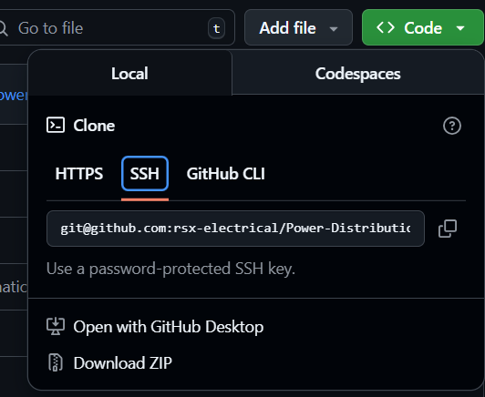
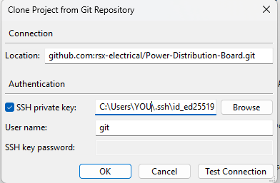

# Setting Up KiCad Projects with Git Revision Control

This guide walks you through setting up a **KiCad** project with **Git** for version control on GitHub.

---

## 1. Generate an SSH Key

Follow GitHub’s official guide - **Only do "Generating a New SSH Key" step**:  
[Generating a new SSH key and adding it to the ssh-agent](https://docs.github.com/en/authentication/connecting-to-github-with-ssh/generating-a-new-ssh-key-and-adding-it-to-the-ssh-agent?platform=windows#generating-a-new-ssh-key)

---

## 2. Get SSH remote URL
Go to the Github page for the project. Code > Local > SSH
Copy the line that starts with ```git@github.com:rsx-electrical...```

<div align="center">
     
     <p><i>Figure 1: Github website</i></p>
</div>
---

## 3. Go to Kicad 
1. File > Clone Project From Repository
2. Paste the SSH remote URL into the "Location" box 
3. Select SSH private key and enter the path to the SSH private key saved from step 1.
> - Windows: the path may look like ```c:/Users/YOU/.ssh/id_ed25519```
4. Press OK

<div align="center">
     
     <p><i>Figure 2: Clone Project From Repository window in Kicad</i></p>
</div>
