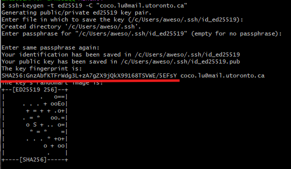
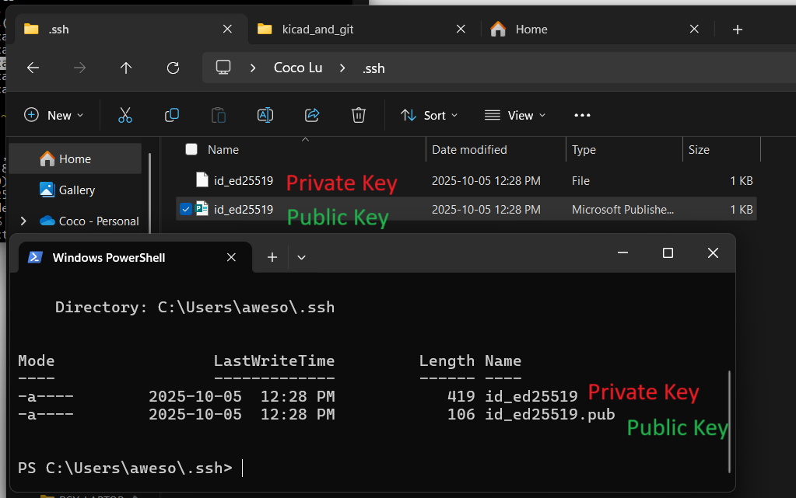
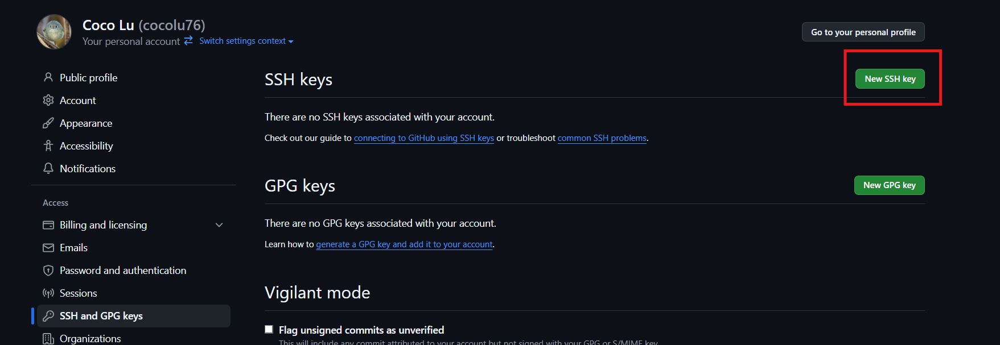
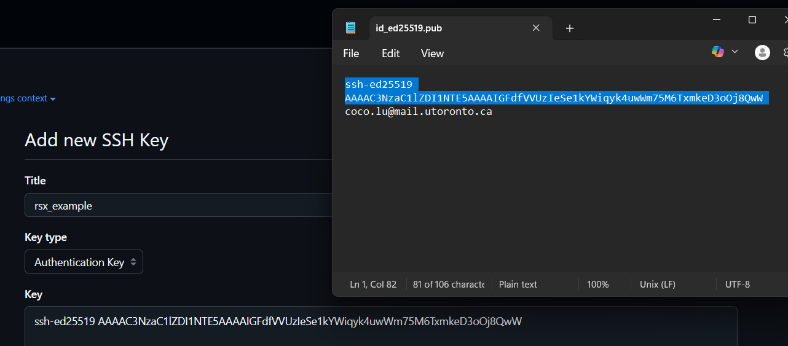
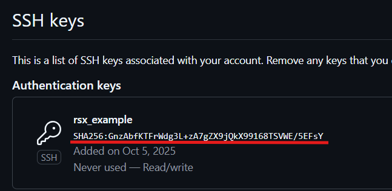

# Setting Up KiCad Projects with Git Revision Control

This guide walks you through setting up a **KiCad** project with **Git** for version control on GitHub.

---

## 1. Generate an SSH Key

Follow GitHub’s official guide - **Only do "Generating a New SSH Key" step**:  
[Generating a new SSH key and adding it to the ssh-agent](https://docs.github.com/en/authentication/connecting-to-github-with-ssh/generating-a-new-ssh-key-and-adding-it-to-the-ssh-agent?platform=windows#generating-a-new-ssh-key)

### 1A. Windows:
> i. Open Git Bash.  
> ii. Paste ```ssh-keygen -t ed25519 -C "your_email@example.com"```, replacing the email used in the example with your GitHub email address.  
> iii. You'll be prompted for ```> Enter file in which to save the key (/c/Users/YOU/.ssh/id_ALGORITHM):``` --> press enter to save in default location (c/User/YOU/.ssh/id_ALGORITHM)  
> iv. You'll be prompted for  
> ```
> > Enter passphrase for /c/Users/YOU/.ssh/id_ALGORITHM (empty for no passphrase): 
> > Enter same passphrase again: [Type passphrase again]
> ```
> --> press enter twice  
> v. You should see: the "Key fingerprint" is underlined  
<div align="center">
     
</div>

> vi. Open where you saved the ssh earlier (c/User/YOU/.ssh)  
> vii. This is what I see. Open the **public key** (the private key will be used later in Kicad in step 3)

<div align="center">
     
</div>

> viii. Copy the thing excluding your email into the "Key" section in "Add new SSH Key" in Github
<div align="center">
     
</div>

<div align="center">
     
</div>

>> This key could start with 'ssh-rsa', 'ecdsa-sha2-nistp256', 'ecdsa-sha-nistp384', 'ecdsa-sha2-nistp521', 'ssh-ed25519' (in this example), 'sk-ecdsa-sha2-nistp256@openssh.com', or 'sk-ssh-ed25519@openssh.com'  

> ix. After adding the key successfully, you should see a matching "Key fingerprint' that you got from Git Bash earlier.
<div align="center">
     
</div>
---

## 2. Get SSH remote URL
Go to the Github page for the project. Code > Local > SSH
Copy the line that starts with ```git@github.com:rsx-electrical...```

<div align="center">
     
     <p><i>Figure 1: Github website</i></p>
</div>
---

## 3. Go to Kicad 
1. File > Clone Project From Repository
2. Paste the SSH remote URL into the "Location" box 
3. Select SSH private key and enter the path to the SSH private key saved from step 1.
> - Windows: the path may look like ```c:/Users/YOU/.ssh/id_ed25519```
4. Press OK

<div align="center">
     
     <p><i>Figure 2: Clone Project From Repository window in Kicad</i></p>
</div>
